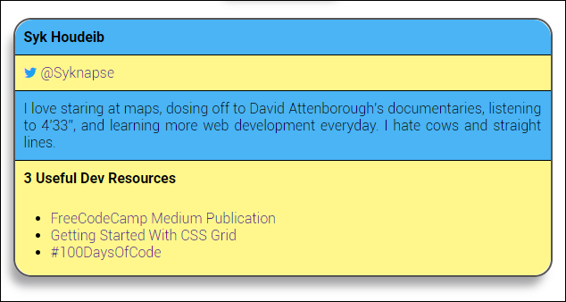

# Contribute To This Project

## Introduction

This a project to help first-time contributors to participate in a simple and easy project.

### Objectives

+ Make a contribution to an open source project.
+ Get more comfortable using GitHub.

### Who is this for?

+ This is for absolute beginners. If you know how to write and edit an anchor tag `` then you should be able to do it.
+ It is for those with a little more experience but who want to make their first open source contribution, or get more contributions for more experience and confidence.

### Why do I need to do this?

Any web developer, aspiring or experienced needs to use Git version control, and GitHub is the most popular Git hosting service used by everyone. It is also the heart of the Open Source community. Getting comfortable using GitHub is an essential skill. Making a contribution to a project boosts your confidence and gives you something to show on your GitHub profile.

## What am I going to contribute?

You are going to contribute a card just like this one to this project's web page. It will include your name, a photo, your Twitter handle, a short description, and 3 links to useful resources for web developers.

You will make a copy of the card template inside the HTML file and customise it with your own information.

## Setup

First let's get setup to do the work

1. Login to your GitHub account. If you don't yet have an account then signup. I recommend you do the Hello World tutorial before you continue. ////
1. Download GitHub Desktop app. ////
1. Alternatively if you are comfortable using Git on the command line you can do so (here's a similar project that can serve as a guide for the commands needed). ////
1. Even easier still if you use VS Code which comes with integrated Git and allows you to do what we need straight from the editor.

Now that you are all setup let's get on with the business of contributing to the project.

## Contribute

### Step 1: Fork this repository

### Step 2: Clone the repository

### Step 3: Create a new branch

### Step 4: Open the index.html file

### Step 5: Copy the card template

### Step 6: Apply your changes

### Step 7: 

## Next Steps

## Acknowledgements

## Licence